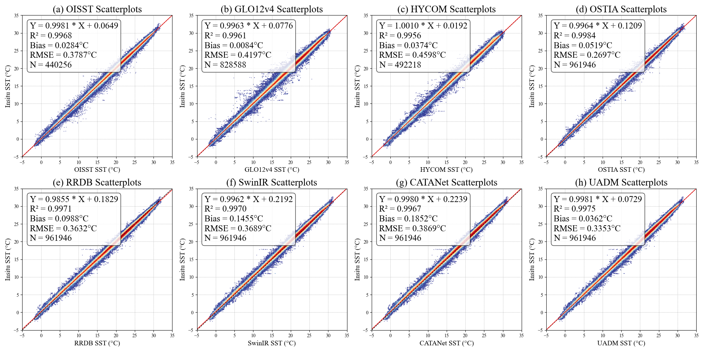

# UADM

This repository is an official implementation of the paper "Uncertainty-Guided Adversarial Diffusion Model for Sea Surface Temperature Super-Resolution".

By Lei Huang, Ke Zhang, Xiaodong Wang,  Jie Nie and Zhiqiang Wei.

> **Abstract:** 
Sea surface temperature (SST) plays a vital role in regulating the Earth's climate system, yet many important processes occur at fine spatial scales that remain unrevealed by most observation- or model-based products.
Learning-based super-resolution has emerged as a promising approach to obtaining high-resolution SST field. 
However, these methods often struggle in key dynamical structures, where high-uncertainty details become particularly susceptible to attenuation during global reconstruction optimization.
To address this limitation, we propose an **u**ncertainty-guided **a**dversarial **d**iffusion **m**odel, UADM. It explicitly quantifies the heterogeneous reconstruction difficulty based on physics as uncertainty, employing it as a guiding signal to reformulate both the generation and discrimination stages.
In the generation stage, an uncertainty-perturbed diffusion model injects anisotropic Gaussian noise, assigning stronger perturbations to regions with pronounced uncertainty to enrich the transition from low- to high-resolution representations. 
In the discrimination stage, an uncertainty-aware adversarial learning scheme imposes pixel-level constraints that deliver stronger feedback to uncertain regions, thereby encouraging the generation to better match the target distributions.
Guided by uncertainty, UADM’s non-uniform modeling concentrates its representational capacity on dynamical structures, thereby effectively enhancing the recovery of fine-scale SST features.
Extensive experiments across global and major ocean basins SST demonstrate that UADM consistently outperforms analysis products and state-of-the-art learning-based methods, yielding results that are not only closer to in situ observations but also capture fine-scale variability.

## Contents

1. [Environment](#environment)
1. [Training](#training)
1. [Testing](#testing)
1. [Results](#visual-results)
1. [Acknowledgements](#acknowledgements)


## Environment
- Python 3.10
- PyTorch 2.4.1

#### Installation

```bash
git clone https://github.com/huanglab-research/UADM.git

conda create -n UADM python=3.10
conda activate UADM

pip install -r requirements.txt
python setup.py develop
```


## Training
#### Data Preparation

- Cut the training [OISST](https://www.ncei.noaa.gov/data/sea-surface-temperature-optimum-interpolation/v2.1/access/avhrr) and [OSTIA](https://ghrsst-pp.metoffice.gov.uk/ostia-website/index.html) products into patches and put them in the folder `./datasets`.

### Training Commands
- Refer to the training configuration files in `./options/` folder for detailed settings.
```bash
# batch size = 2 (GPUs) × 16 (per GPU)

CUDA_VISIBLE_DEVICES=0,1 python -m torch.distributed.launch --use-env --nproc_per_node=2 --master_port=1145  train.py -opt options/Train_UADM_Ocean_x5.yml --launcher pytorch
```


## Testing
#### Data Preparation

- Cut the test [OISST](https://www.ncei.noaa.gov/data/sea-surface-temperature-optimum-interpolation/v2.1/access/avhrr) and [OSTIA](https://ghrsst-pp.metoffice.gov.uk/ostia-website/index.html) products into patches and put them in the folder `./datasets`.

- Load the trained models from folder `./experiments/***`.

#### Testing Commands

- Refer to the testing configuration files in `./options/` folder for detailed settings.
```bash
CUDA_VISIBLE_DEVICES=0 python test.py -opt options/Test_UADM_Ocean_x5.yml
```


## Results



## Acknowledgements
We appreciate the great work of [BasicSR](https://github.com/XPixelGroup/BasicSR) and [ResShift](https://github.com/zsyOAOA/ResShift/tree/journal), etc. Please refer to the original repo for more usage and documents.

Feel free to contact me if there is any question. (Lei Huang: [huangl@ouc.edu.cn](mailto:huangl@ouc.edu.cn), Ke Zhang: [itzhangke@stu.ouc.edu.cn](mailto:itzhangke@stu.ouc.edu.cn), Xiaodong Wang: [wangxiaodong@ouc.edu.cn](mailto:wangxiaodong@ouc.edu.cn))

Note: The source code is currently incomplete and will be fully released once the manuscript is accepted by the journal.
